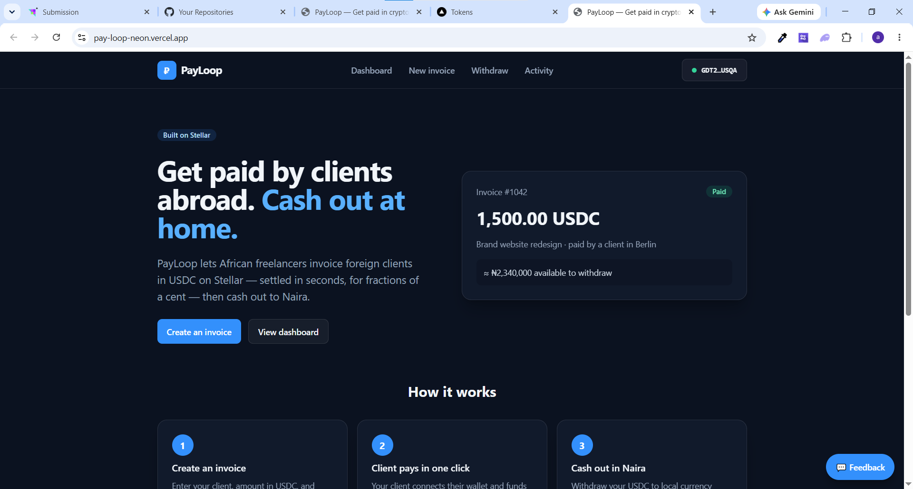
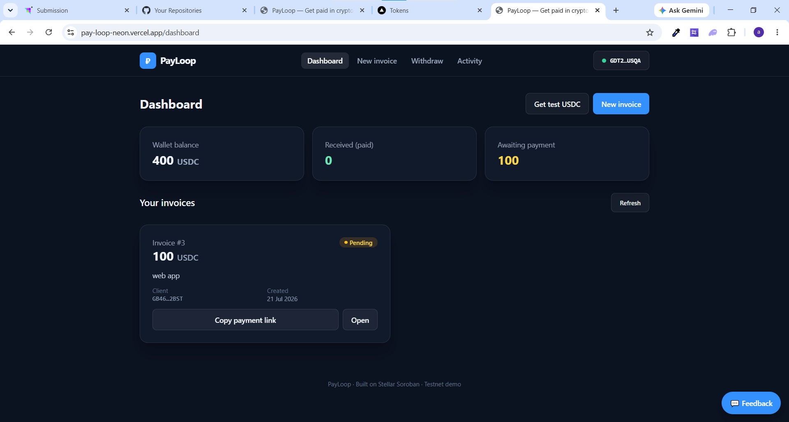
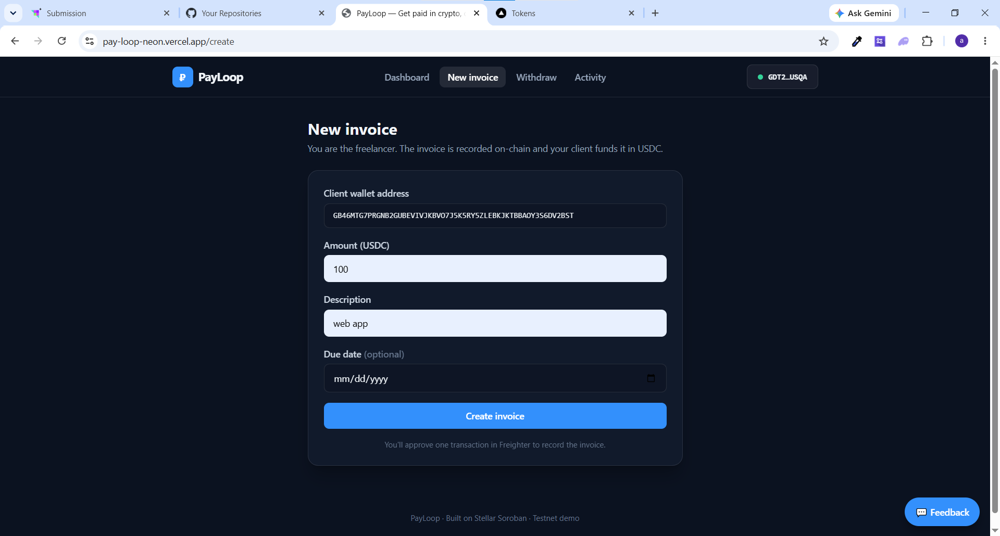
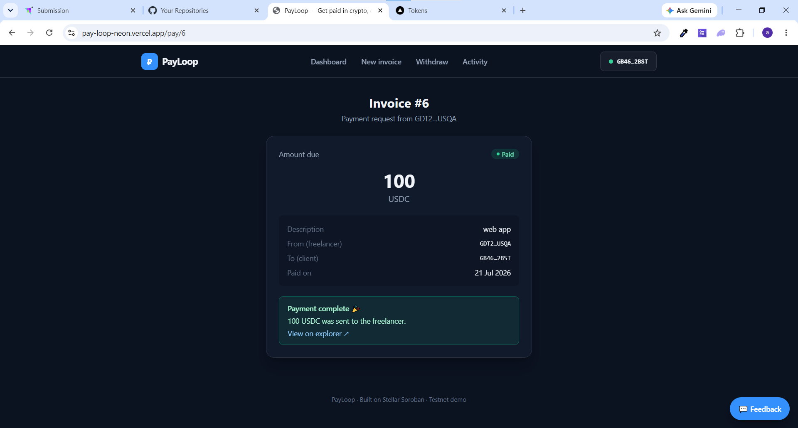
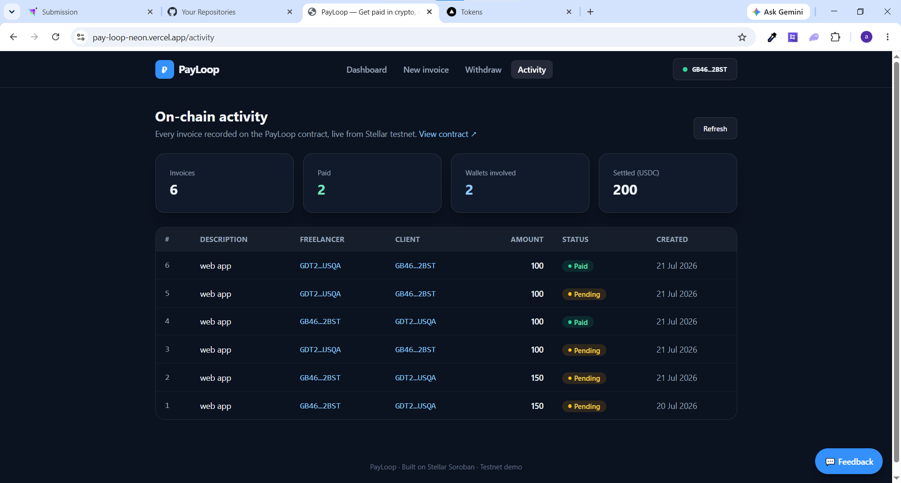
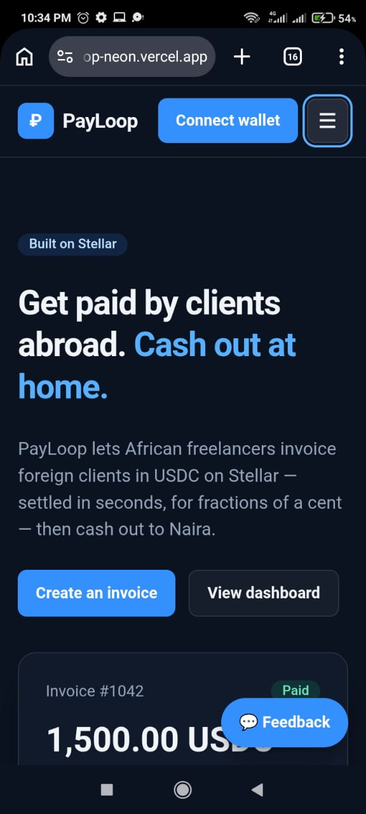

# PayLoop

**Get paid for freelance work in seconds, not weeks — with a permanent, portable income record.**

PayLoop is an invoicing + escrow dApp built on [Stellar](https://stellar.org)/Soroban. It lets freelancers (built with Nigerian & African freelancers working with foreign clients in mind) create an invoice, share a payment link, and receive **USDC** the moment a client funds it — settling in ~5 seconds for a fraction of a cent, instead of the 2–5 days and 5–8% that PayPal/Payoneer cost. Every paid invoice is a timestamped on-chain record that becomes the freelancer's portable income history.

---

## The core loop

```
create_invoice  →  fund_invoice (client pays, escrow + instant release)  →  Paid, on-chain forever
```

That create → fund → release loop is PayLoop. Everything else is UX around it.

## Why Stellar

| Problem (today) | PayPal / wire | PayLoop on Stellar |
| --- | --- | --- |
| **Speed** | 2–5 days; PayPal 21-day holds | ~5 second settlement |
| **Cost** | 3–5% fee + 5–8% FX markup | fractions of a cent network fee |
| **Income trail** | scattered bank alerts, WhatsApp | tamper-proof on-chain invoice history |
| **Compliance** | you become a money transmitter | anchors handle the regulated fiat on/off-ramp |

## Architecture

- **Smart contract** — `contracts/invoice`, Rust/Soroban, deployed to Stellar **testnet**. Holds invoices and performs the atomic client→freelancer USDC transfer on funding.
- **Web app** — `web/`, Next.js (App Router) + TypeScript + Tailwind, Freighter wallet, deployed on Vercel. Mobile-responsive, with loading/error states throughout.
- **Observability** — Sentry (errors) + Vercel Analytics (usage).
- **Public activity feed** — `/activity` reads every invoice straight off the contract and reports usage stats; doubles as verifiable proof of wallet interactions.
- **Feedback** — in-app widget → `/api/feedback` (forwards to an optional webhook).
- **Anchor off-ramp** — USDC → Naira bank payout is **mocked** for this submission with clear UX and a documented integration path. See [docs/ANCHOR.md](docs/ANCHOR.md).

Full design: [docs/ARCHITECTURE.md](docs/ARCHITECTURE.md).

## Features

- Create an invoice on-chain (client, amount, description, optional due date).
- Share a `/pay/<id>` link; the client funds it in one wallet click.
- Instant settlement — USDC moves client→freelancer atomically, marked `Paid`.
- Freelancer dashboard: invoices, balance, received/pending totals, test-USDC faucet.
- Public on-chain activity feed with unique-wallet and settled-volume stats.
- Mocked USDC→Naira off-ramp with a documented SEP-24 path.
- Monitoring (Sentry) + analytics (Vercel) + in-app feedback collection.

## Deployment

| Item | Value |
| --- | --- |
| Network | Stellar Testnet |
| Invoice contract | [`CAQVSBNVL7OI66IDTYCR7XL4VJKMSOYGBW5D6SWLTWTINTCQO2OGCSXS`](https://stellar.expert/explorer/testnet/contract/CAQVSBNVL7OI66IDTYCR7XL4VJKMSOYGBW5D6SWLTWTINTCQO2OGCSXS) |
| Payment token (test USDC SAC) | [`CA3DMMHKAEV555MKWZB5AFXWB6LVZRETYNUO5ZCFGSENQOC7A2FL5HNU`](https://stellar.expert/explorer/testnet/contract/CA3DMMHKAEV555MKWZB5AFXWB6LVZRETYNUO5ZCFGSENQOC7A2FL5HNU) |
| Live app | https://pay-loop-neon.vercel.app |

Full deployment metadata: [`contracts/deployment.testnet.json`](contracts/deployment.testnet.json).

### Deploy the web app (Vercel)

The app is a standard Next.js project. From `web/`:

```bash
npm install
vercel --prod          # or import the repo in the Vercel dashboard
```

Set the root directory to `web/`. The public testnet contract/token addresses
are baked in as defaults, so the app works with **zero** env vars. To enable the
faucet, monitoring, or feedback forwarding, set `USDC_ISSUER_SECRET`,
`NEXT_PUBLIC_SENTRY_DSN` (+ `SENTRY_ORG`/`SENTRY_PROJECT`), and
`FEEDBACK_WEBHOOK_URL` in the Vercel project settings. See
[web/.env.example](web/.env.example).

## Screenshots & demo

| | |
| --- | --- |
| **Landing** | **Dashboard** |
|  |  |
| **Create invoice** | **Payment — paid** |
|  |  |
| **On-chain activity** | **Mobile** |
|  |  |

More in [docs/screenshots/](docs/screenshots/). The demo-video script, onboarding
steps, and how to capture proof of wallet interactions are in [DEMO.md](DEMO.md).
The user-feedback summary is in [docs/FEEDBACK.md](docs/FEEDBACK.md).

## Submission (Level 4 — Green Belt)

- **Requirement-by-requirement checklist:** [SUBMISSION.md](SUBMISSION.md)
- **Proof of user wallet interactions:** [docs/USERS.md](docs/USERS.md) +
  the live [Activity page](https://pay-loop-neon.vercel.app/activity)
- **User feedback summary:** [docs/FEEDBACK.md](docs/FEEDBACK.md)

## Local development

Prerequisites: Node 20+, Rust + `stellar` CLI (`cargo install --locked stellar-cli`).

```bash
# Contract
cd contracts/invoice
cargo test                    # run unit tests
stellar contract build        # build the wasm

# Web
cd web
cp .env.example .env.local     # fill in contract + token addresses
npm install
npm run dev
```

See [contracts/DEPLOYMENT.md](contracts/DEPLOYMENT.md) for the full testnet deploy + token setup steps.

## Repository layout

```
PayLoop/
├── contracts/
│   ├── invoice/               Soroban invoice/escrow contract (Rust) + tests
│   ├── DEPLOYMENT.md          Testnet deploy + token setup steps
│   └── deployment.testnet.json
├── web/                       Next.js frontend (App Router)
│   ├── app/                   routes incl. /activity, /api/faucet, /api/feedback
│   ├── components/            wallet provider, UI, feedback widget
│   └── lib/                   config, wallet, contract, format
├── docs/
│   ├── ARCHITECTURE.md        System design
│   ├── ANCHOR.md              Mock vs. production off-ramp (SEP-24)
│   ├── FEEDBACK.md            User-feedback summary
│   └── screenshots/           Submission screenshots
├── DEMO.md                    Demo-video + user-onboarding checklist
└── README.md
```

## Roadmap

- **MVP (this):** single invoice, shareable pay link, instant release on fund, on-chain history.
- **Next:** live USDC↔Naira anchor off-ramp, milestone-based escrow (deposit + final), on-chain reputation score, recurring/retainer invoices, multi-stablecoin, agency batch payouts.

## License

MIT
