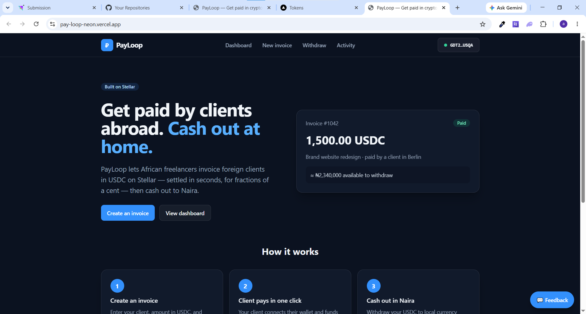
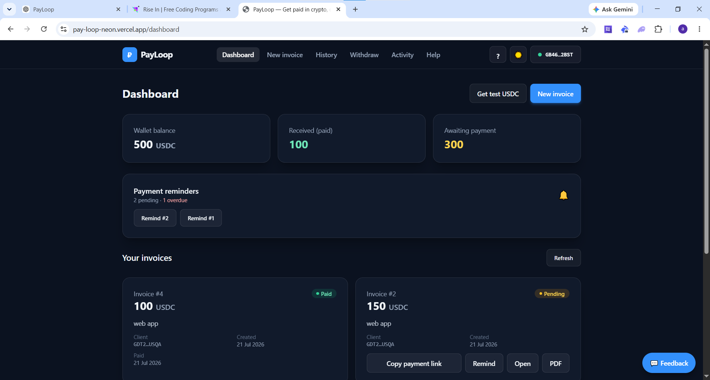
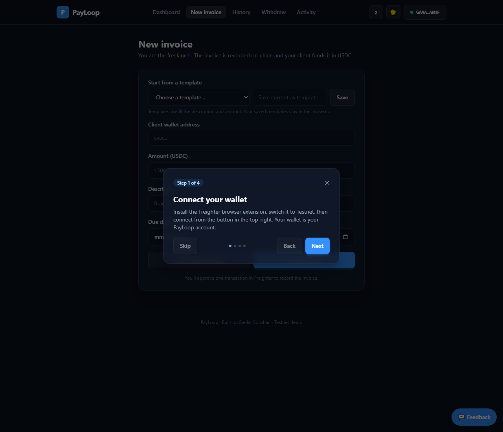
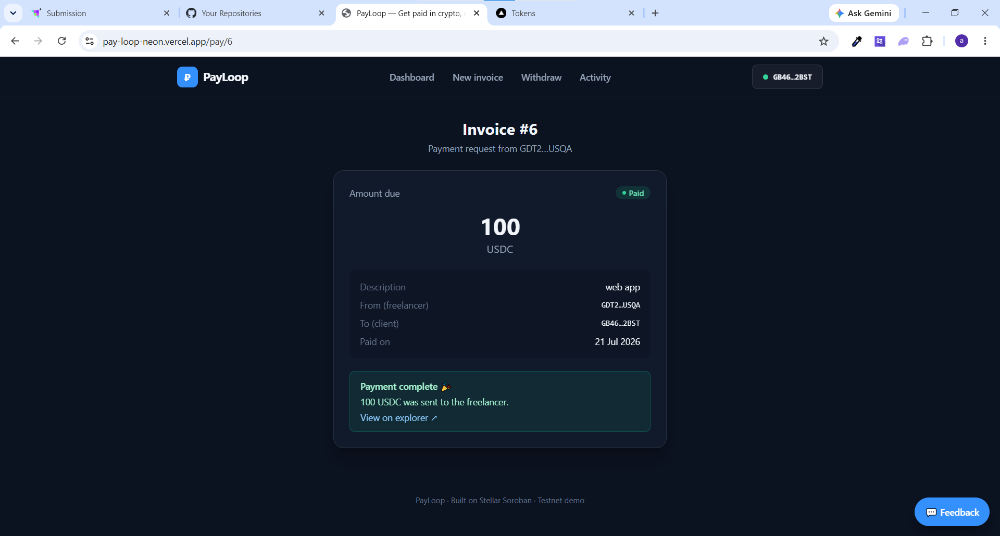
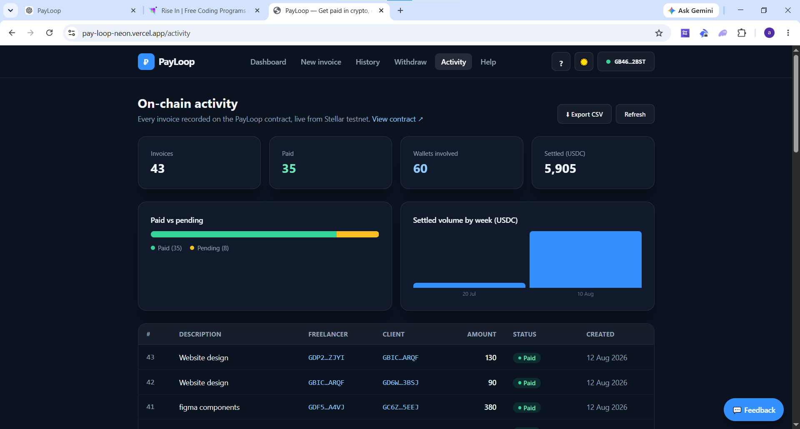
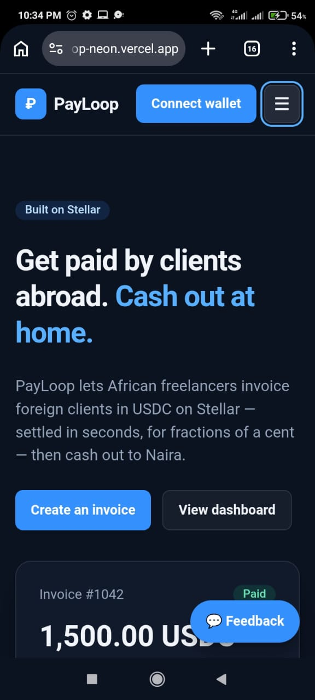
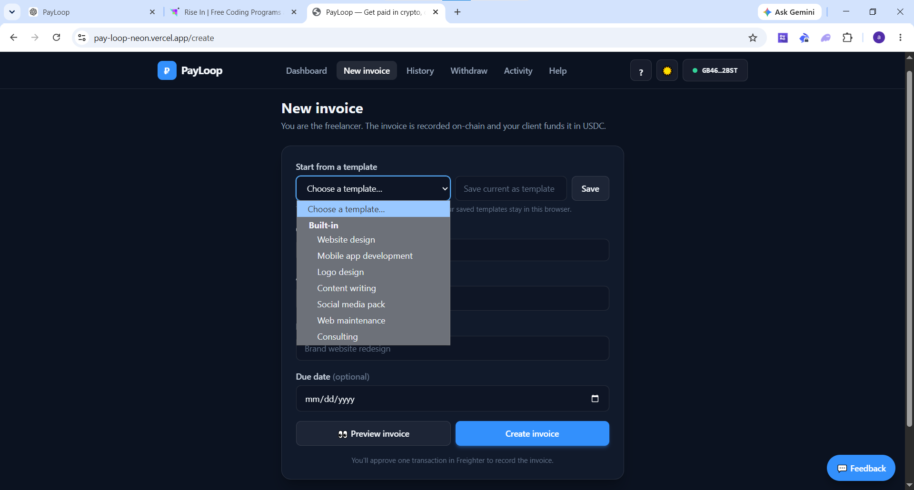
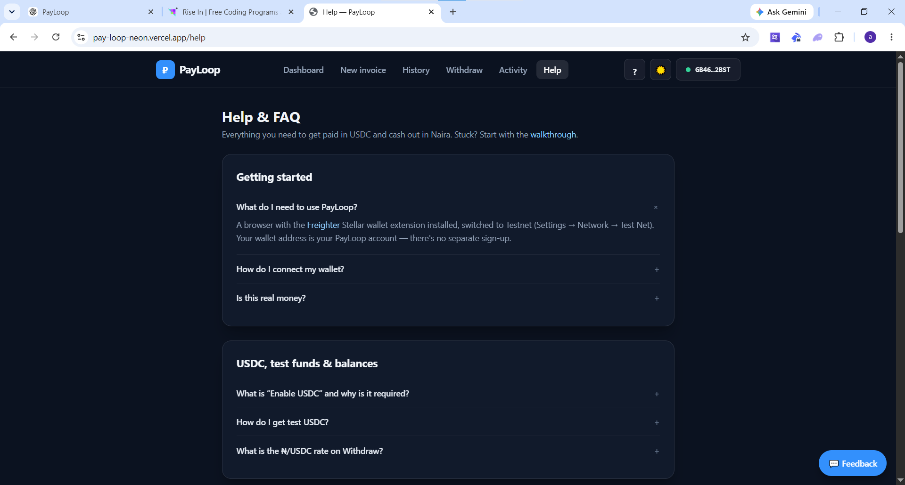
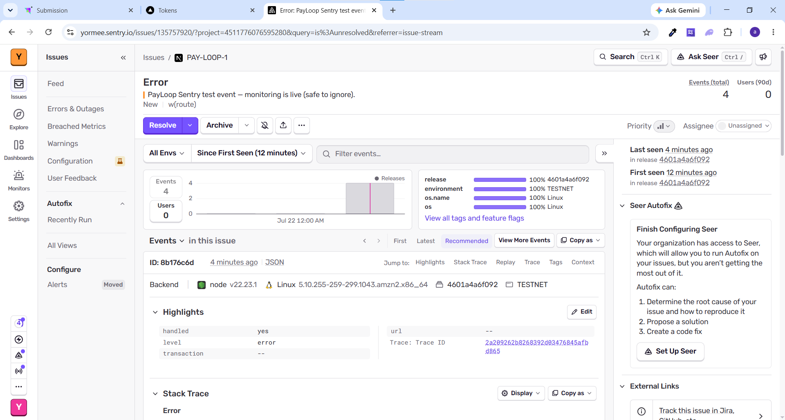

# PayLoop

[](https://github.com/Yormee-103/PayLoop/actions/workflows/contract.yml)
[](https://github.com/Yormee-103/PayLoop/actions/workflows/web.yml)
[](https://github.com/Yormee-103/PayLoop/actions/workflows/deploy.yml)

**Get paid for freelance work in seconds, not weeks — with a permanent, portable income record.**

PayLoop is an invoicing + escrow dApp built on [Stellar](https://stellar.org)/Soroban. It lets freelancers (built with Nigerian & African freelancers working with foreign clients in mind) create an invoice, share a payment link, and receive **USDC** the moment a client funds it — settling in ~5 seconds for a fraction of a cent, instead of the 2–5 days and 5–8% that PayPal/Payoneer cost. Every paid invoice is a timestamped on-chain record that becomes the freelancer's portable income history.

---

## The core loop

```
create_invoice  →  fund_invoice (client pays, escrow + instant release)  →  Paid, on-chain forever
```

That create → fund → release loop is PayLoop. Everything else is UX around it.

**🔗 Live app:** https://pay-loop-neon.vercel.app &nbsp;·&nbsp; **🎬 Demo video:** https://www.loom.com/share/0b08c1208df841ac96ecd61b2b05a7a9
**🎤 Pitch deck:** [/pitch](https://pay-loop-neon.vercel.app/pitch) (web) ·
[PayLoop-Pitch-Deck.pptx](docs/pitch/PayLoop-Pitch-Deck.pptx)

---

## Level 5 — Blue Belt

This level is about growth, iteration, and pitching. Everything shipped here is
driven by the user feedback collected in Level 4.

### User growth & usage proof

- **60 testnet users** onboarded with real wallet transactions — proof log in
  [docs/USERS.md](docs/USERS.md), live on the
  [Activity page](https://pay-loop-neon.vercel.app/activity) (unique-wallet +
  invoice counts, **Export CSV**), and on
  [stellar.expert](https://stellar.expert/explorer/testnet/contract/CAQVSBNVL7OI66IDTYCR7XL4VJKMSOYGBW5D6SWLTWTINTCQO2OGCSXS).
- **On-chain activity snapshot (point-in-time, 2026-08-12):**
  [docs/testnet-traction.csv](docs/testnet-traction.csv) — 42 invoices
  on-chain, 34 Paid. This is a committed snapshot, not a live figure; for the
  current on-chain count (43 invoices, 35 Paid as of this writing), see the
  live [Activity page](https://pay-loop-neon.vercel.app/activity).

### Feedback collection & Excel export

- **Feedback collection:** a user survey collecting name, email, wallet
  address, network, product rating and written feedback.
- **Raw responses (Google Sheet):**
  [view-only link](https://docs.google.com/spreadsheets/d/10_oCs3CjUw0oyTaaj1oU0VTFeQ2ZKAFkH-K1sr7s5mQ/edit?gid=195454051#gid=195454051).
- **Excel export (committed):** [`docs/survey-responses.xlsx`](docs/survey-responses.xlsx)
  — generated from the form CSV by `python3 scripts/build-excel.py`, with a
  **Responses** sheet (every user) and a **Summary** sheet (metrics).

### Product iteration (feedback → shipped, with commits)

The full traceability table — each user request, the feature that shipped, and
its commit — is in **[docs/GROWTH.md](docs/GROWTH.md)**. Summary of what shipped:

- **Invoice history** page with search + status/role filters
- **Invoice preview** before sending
- **PDF export** for any invoice (and paid receipts)
- **Onboarding walkthrough** (first-run tour + navbar "?")
- **Payment reminders** (one-click copy-to-send)
- **Dark/light mode** toggle (dark default)
- **UX polish**: retry on all load errors, stronger buttons, better empty states
- **Analytics**: activity-page CSV export + live usage stats

### Pitch & demo

- **Pitch deck:** web [/pitch](https://pay-loop-neon.vercel.app/pitch) ·
  downloadable [`PayLoop-Pitch-Deck.pptx`](docs/pitch/PayLoop-Pitch-Deck.pptx)
  (generated by `python3 scripts/build-pitch.py`).
- **Demo video:** Level-5 walkthrough covering create → preview → pay → history →
  activity → withdraw — script in [DEMO.md](DEMO.md).

### Submission checklist

Mapped requirement-by-requirement in [SUBMISSION.md](SUBMISSION.md).

---

## Why Stellar

| Problem (today) | PayPal / wire | PayLoop on Stellar |
| --- | --- | --- |
| **Speed** | 2–5 days; PayPal 21-day holds | ~5 second settlement |
| **Cost** | 3–5% fee + 5–8% FX markup | fractions of a cent network fee |
| **Income trail** | scattered bank alerts, WhatsApp | tamper-proof on-chain invoice history |
| **Compliance** | you become a money transmitter | anchors handle the regulated fiat on/off-ramp |

## Architecture

- **Smart contract** — `contracts/invoice`, Rust/Soroban, deployed to Stellar **testnet**. Holds invoices and performs the atomic client→freelancer USDC transfer on funding.
- **Web app** — `web/`, Next.js (App Router) + TypeScript + Tailwind, Freighter wallet, deployed on Vercel. Mobile-responsive, with loading/error states throughout.
- **Observability** — Sentry (errors) + Vercel Analytics (usage).
- **Public activity feed** — `/activity` reads every invoice straight off the contract and reports usage stats; doubles as verifiable proof of wallet interactions.
- **Feedback** — in-app widget → `/api/feedback` (forwards to an optional webhook).
- **Anchor off-ramp** — USDC → Naira bank payout is **mocked** for this submission with clear UX and a documented integration path. See [docs/ANCHOR.md](docs/ANCHOR.md).

Full design: [docs/ARCHITECTURE.md](docs/ARCHITECTURE.md).

## Features

- Create an invoice on-chain (client, amount, description, optional due date).
- **Preview the invoice** before it goes on-chain, and **export any invoice as PDF**.
- Share a `/pay/<id>` link; the client funds it in one wallet click.
- Instant settlement — USDC moves client→freelancer atomically, marked `Paid`.
- **Invoice history** page with search + status/role filtering and **payment
  reminders** (one-click copy-to-send).
- Freelancer dashboard: invoices, balance, received/pending totals, test-USDC faucet,
  and an **overdue/pending reminders** card.
- Public on-chain activity feed with unique-wallet and settled-volume stats +
  **CSV export**.
- **Dark/light mode** toggle (dark default) and a **first-run onboarding tour**.
- Mocked USDC→Naira off-ramp with a documented SEP-24 path.
- Monitoring (Sentry) + analytics (Vercel) + in-app feedback collection.
- **Pitch deck** live at [/pitch](https://pay-loop-neon.vercel.app/pitch).

## Deployment

| Item | Value |
| --- | --- |
| Network | Stellar Testnet |
| Invoice contract | [`CAQVSBNVL7OI66IDTYCR7XL4VJKMSOYGBW5D6SWLTWTINTCQO2OGCSXS`](https://stellar.expert/explorer/testnet/contract/CAQVSBNVL7OI66IDTYCR7XL4VJKMSOYGBW5D6SWLTWTINTCQO2OGCSXS) |
| Payment token (test USDC SAC) | [`CA3DMMHKAEV555MKWZB5AFXWB6LVZRETYNUO5ZCFGSENQOC7A2FL5HNU`](https://stellar.expert/explorer/testnet/contract/CA3DMMHKAEV555MKWZB5AFXWB6LVZRETYNUO5ZCFGSENQOC7A2FL5HNU) |
| Live app | https://pay-loop-neon.vercel.app |

Full deployment metadata: [`contracts/deployment.testnet.json`](contracts/deployment.testnet.json).

### Deploy the web app (Vercel)

The app is a standard Next.js project. From `web/`:

```bash
npm install
vercel --prod          # or import the repo in the Vercel dashboard
```

Set the root directory to `web/`. The public testnet contract/token addresses
are baked in as defaults, so the app works with **zero** env vars. To enable the
faucet, monitoring, or feedback forwarding, set `USDC_ISSUER_SECRET`,
`NEXT_PUBLIC_SENTRY_DSN` (+ `SENTRY_ORG`/`SENTRY_PROJECT`), and
`FEEDBACK_WEBHOOK_URL` in the Vercel project settings. See
[web/.env.example](web/.env.example).

### CI/CD

GitHub Actions runs on every push and pull request
([`.github/workflows/`](.github/workflows/)):

| Workflow | What it does |
| --- | --- |
| [`contract.yml`](.github/workflows/contract.yml) | **Contract CI** — `cargo fmt --check`, `clippy`, `cargo test`, and an optimized `wasm32v1-none` release build (uploaded as an artifact) |
| [`web.yml`](.github/workflows/web.yml) | **Web CI** — `npm ci`, `npm run lint`, `npm run build` |
| [`deploy.yml`](.github/workflows/deploy.yml) | **CD** — Vercel production deploy on push to `main` (via the Vercel CLI when `VERCEL_*` secrets are set; Vercel's native Git integration otherwise) |

## Screenshots & demo

| | |
| --- | --- |
| **Landing** | **Dashboard** |
|  |  |
| **Create invoice (with templates)** | **Payment — paid** |
|  |  |
| **On-chain activity** | **Mobile** |
|  |  |
| **Template picker** | **Help / FAQ** |
|  |  |
| **Monitoring (Sentry)** | |
|  | |

More in [docs/screenshots/](docs/screenshots/) — see
[docs/GROWTH.md](docs/GROWTH.md) for the full feedback → shipped trace.

**Watch the 🎬 [demo video](https://www.loom.com/share/0b08c1208df841ac96ecd61b2b05a7a9)** for the full create → pay → on-chain loop. The demo-video script, onboarding
steps, and how to capture proof of wallet interactions are in [DEMO.md](DEMO.md).
The user-feedback summary (60 responses, avg 5.2/6) is in
[docs/FEEDBACK.md](docs/FEEDBACK.md), collected via a user survey —
[raw responses (Google Sheet)](https://docs.google.com/spreadsheets/d/10_oCs3CjUw0oyTaaj1oU0VTFeQ2ZKAFkH-K1sr7s5mQ/edit?gid=195454051#gid=195454051).

## Submission (Level 5 — Blue Belt)

- **Requirement-by-requirement checklist:** [SUBMISSION.md](SUBMISSION.md)
- **Proof of 60 user wallet interactions:** [docs/USERS.md](docs/USERS.md) +
  the live [Activity page](https://pay-loop-neon.vercel.app/activity)
- **User feedback iteration summary:** [docs/FEEDBACK.md](docs/FEEDBACK.md) +
  [docs/GROWTH.md](docs/GROWTH.md)
- **Growth & onboarding plan:** [docs/GROWTH.md](docs/GROWTH.md)
- **Excel export of survey responses:** [`docs/survey-responses.xlsx`](docs/survey-responses.xlsx)

## Local development

Prerequisites: Node 20+, Rust + `stellar` CLI (`cargo install --locked stellar-cli`).

```bash
# Contract
cd contracts/invoice
cargo test                    # run unit tests
stellar contract build        # build the wasm

# Web
cd web
cp .env.example .env.local     # fill in contract + token addresses
npm install
npm run dev
```

See [contracts/DEPLOYMENT.md](contracts/DEPLOYMENT.md) for the full testnet deploy + token setup steps.

## Repository layout

```
PayLoop/
├── .github/workflows/         CI (contract + web) and CD (Vercel) pipelines
├── contracts/
│   ├── invoice/               Soroban invoice/escrow contract (Rust) + tests
│   ├── DEPLOYMENT.md          Testnet deploy + token setup steps
│   └── deployment.testnet.json
├── scripts/
│   ├── build-excel.py         Generate docs/survey-responses.xlsx (stdlib only)
│   └── build-pitch.py         Generate the .pptx pitch deck (stdlib only)
├── web/                       Next.js frontend (App Router)
│   ├── app/                   routes incl. /history, /pitch, /activity, /api/*
│   ├── components/            wallet, theme, tour, invoice document, feedback
│   └── lib/                   config, wallet, contract, format
├── docs/
│   ├── ARCHITECTURE.md        System design
│   ├── ANCHOR.md              Mock vs. production off-ramp (SEP-24)
│   ├── FEEDBACK.md            User-feedback summary
│   ├── GROWTH.md              Feedback→shipped table + next-phase plan
│   ├── USERS.md               60-user proof log
│   ├── survey-responses.csv   Google Form CSV export
│   ├── survey-responses.xlsx  Generated Excel export (Responses + Summary)
│   ├── testnet-traction.csv   On-chain invoice activity snapshot
│   ├── pitch/                 PayLoop-Pitch-Deck.pptx
│   └── screenshots/           Submission screenshots
├── DEMO.md                    Demo-video + user-onboarding checklist
└── README.md
```

## Roadmap

- **MVP (this):** single invoice, shareable pay link, instant release on fund, on-chain history.
- **Next:** live USDC↔Naira anchor off-ramp, milestone-based escrow (deposit + final), on-chain reputation score, recurring/retainer invoices, multi-stablecoin, agency batch payouts.

## License

MIT
